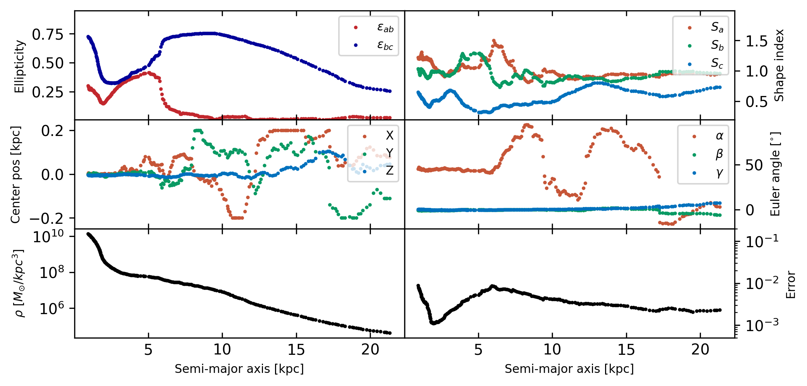

## Introduction

This folder contains example notebooks for the Python package **gal3d** (to be made public after paper submission).

## Example

See [example_ellipsoid_s.ipynb](example_ellipsoid_s.ipynb) for a demonstration using a galaxy from the TNG50 simulation. The adopted shape model is **Ellipsoid_S**:

$$
[\left(\frac{x}{a}\right)^{2}]^{S_a} + [\left(\frac{y}{b}\right)^{2}]^{S_b} + [\left(\frac{z}{c}\right)^{2}]^{S_c} = 1
$$

where

$$
0.2 \leq S_a, S_b, S_c \leq 2,\quad c \leq b \leq a
$$

The shape of the equal-density surface is characterized by:

- **Ellipticity:**
  - $\epsilon_{ab} = 1 - \frac{b}{a}$
  - $\epsilon_{bc} = 1 - \frac{c}{b}$
- **Shape Indices:**
  - $S_a, S_b, S_c$

Model residuals:

Corresponding fitted parameter profile:

