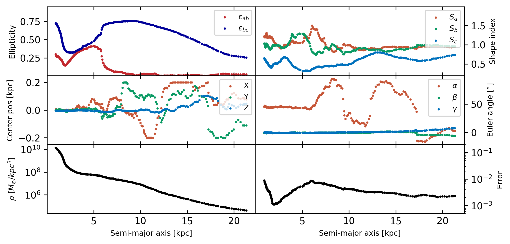

## Introduction

This folder contains example notebooks for the Python package **gal3d** (to be made public after paper submission).

Source code for the package is available at https://github.com/GalaxySimAnalytics/gal3d

## Example

See [example_ellipsoid_s.ipynb](example_ellipsoid_s.ipynb) for a demonstration using a galaxy from the TNG50 simulation. The adopted shape model is **Superellipsoid**:

$$
f(x,y,z) = \Bigl[\Bigl(\frac{x}{a}\Bigr)^2\Bigr]^{S_a}
+\Bigl[\Bigl(\frac{y}{b}\Bigr)^2\Bigr]^{S_b}
+\Bigl[\Bigl(\frac{z}{c}\Bigr)^2\Bigr]^{S_c}.
$$

where

$$
0.2 \leq S_a, S_b, S_c \leq 2 \quad \text{and} \quad a \ge b \ge c > 0
$$

The shape of the equal-density surface is characterized by:

- **Ellipticity:**
  - $\epsilon_{ab} = 1 - \frac{b}{a}$
  - $\epsilon_{bc} = 1 - \frac{c}{b}$
- **Shape Indices:**
  - $S_a, S_b, S_c$

Model residuals:

Corresponding fitted parameter profile:

